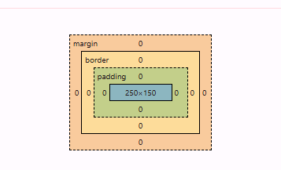
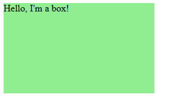
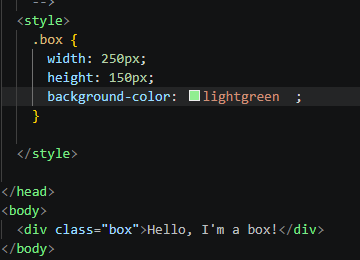

# Box Model

Fuente: https://developer.mozilla.org/es/docs/Web/CSS/Guides/Box_model/Introduction

- El Box Model (modelo de caja) es la forma en la que CSS representa cada elemento de una página web.
- Every HTML element is a rectangular box with four layers (Content- padding - border - margin)
- Determines how elements take out space on a web page
- content area (width and height) only affects the content area
- padding create space betwwen content and border padding: 20px 20px 15px 15px; /* top - right - bottom - left*/
- border wraps around de content and padding
- border have border-width (grosor), border-style(estilo) and border-color(color) border: 5px solid black;
- Common border styles : solid - dashed - dotted -double - groove - ridge - inset
- Margin create space outside the border, separating elements

```txt
.box {
  width: 200px;
  padding: 20px;
  border: 5px solid black;
  margin: 30px;
}
```


- margin:auto le dice al navegador Calcula automáticamente los márgenes necesarios.

```txt
  Contenedor: 800px
  La caja ocupa: 200px
  El espacio restante es: 800 px - 200 px = 600 px
  El navegador divide esos 600px entre los márgenes izquierdo y derecho: 300 px ← caja → 300 px
  Por eso, margin: auto; suele utilizarse para centrar elementos horizontalmente.
```

```txt

.box {
  width: 200px;
  margin: 0 auto; top - right - bottom - left
}

Arriba: 0
Derecha: automática
Abajo: 0
Izquierda: automática

```






- By default width and height exclude padding and border.
- Box-sizing: border-box hacen que el width and height de la caja se mantenga fija y se incluye el padding y el border. Keeping the box size fixed.

```txt
Cuanto mide la cajita - por default el css calcula como: box-sizing: content-box;
Width total de la caja : 200px + 20px(padding right) + 20px(padding left) + 5px(border right) + 5px(border left) = 250px
Height total de la caja : 200px + 20px + 20px + 5px + 5px = 250px (padding + border) Top y bottom
El margen no forma parte del tamaño del elemento. Solo añade espacio alrededor.
     
Con box-sizing:border-box
width: 200px
height: 200px 
En el calculo esta incluido el padding y el border
```

- Box-shadow 3D effect around an element

/* Keyword values */
box-shadow: none;

/* offset-x | offset-y | color */
box-shadow: 60px -16px teal;

/* offset-x | offset-y | blur-radius | color */
box-shadow: 10px 5px 5px black;

/* offset-x | offset-y | blur-radius | spread-radius | color */
box-shadow: 2px 2px 2px 1px rgba(0, 0, 0, 0.2);

/* inset | offset-x | offset-y | color */
box-shadow: inset 5em 1em gold;

/* Any number of shadows, separated by commas */
box-shadow:
  3px 3px red,
  -1em 0 0.4em olive;

/* Global keywords */
box-shadow: inherit;
box-shadow: initial;
box-shadow: unset;